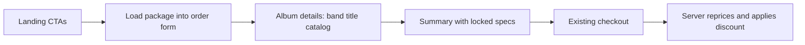

# Package deals, discounts, and DB backups

Deferred plan. Do not implement until this work is picked up again.

## Already done

- Cursor rule added at `.cursor/rules/wsl-and-deploy.mdc`: WSL for all commands, `./scripts/deploy.sh` as the deploy path, and deploy app/schema changes to heliospressing.com when work is complete. Rule-only/docs-only changes are not deployed.

## DB backups: none on the app server

Checked production cron/timers. Findings:

- `ubuntu` crontab is empty
- `root` crontab only renews certbot at 03:00
- No `/opt/postgres-backups` (or similar) directory
- `/home/ubuntu/db_backup.sql` is a one-off dump, not a job
- `dpkg-db-backup.timer` is the Debian package database, not Postgres

The mail server has MySQL backups; the app server does **not** dump `helios-db`.

Add a nightly `pg_dump` (keep ~7 days) under something like `/opt/apps/shared/db-backups`, owned by ubuntu, via root crontab. Follow the same idea as `helios-secrets/mail/mail-server-setup.sh`, but for Postgres. Verify with a manual run after install.

## Discount system (does not exist today)

WooCommerce coupon leftovers in mocks are unused. Server pricing in `helios-api/app/services/CartService.ts` is `subtotal + shipping` only. The bank-transfer “5% discount” in `PaymentOptionsCard.jsx` is copy; `jira-tasks.md` `HELIOS-358` is still open. **Do not implement bank-transfer 5% in this work.**

Build a small order-level discount used first by packages:

- `discountAmount = max(0, catalogSubtotal - advertisedPrice)`
- Pressing total = advertised price when that is lower than catalog; otherwise charge catalog (no negative discount)
- Grand total = pressing total + shipping
- Recompute on the **server** in `OrderService.ts` / `CartService.getTotalPrice`. Never trust a client-sent total.

Persist on `orders`: `package_id` (nullable), `discount_amount`, `catalog_subtotal` (so invoices still make sense if catalog prices change later).

Show a discount line on:

- `OrderSummarySidePanel.jsx`
- `CompletedOrderDetailsCard.jsx`
- `OrderCreated.ts`

Keep the helper generic (`DiscountService`) so a later bank-transfer 5% can stack as another line item.

## Package deals

**Customer path:** advertised pressing price; after album info, skip locked steps and land on Summary, then checkout as today.

### Data

New `packages` table, same style as `record_colors`:

- `name`, unique `slug`, optional description / CTA label
- `advertised_price` (pressing only; shipping extra)
- `is_active`, `sort_order`
- `form_config` JSON: locked order-form fields (`albumType`, `weight`, `totalQuantity`, `testPresses`, `colors`, `centerLabel`, packaging/insert/assembly/polybag, and `colorsVerified: true`)

Public `GET /api/packages` (active only). Admin CRUD under `/api/admin/packages`, cloned from `record_colors_controller.ts` + `ColorManagementCard.jsx`.

Admin form should reuse the existing order-form field components so a package is configured like a real quote. Show live catalog subtotal vs advertised price so the implied discount is obvious. Reject save if advertised price is `<= 0` or `>=` current catalog subtotal (no “discount” that raises the price).

### Customer UI

- `LandingPage.jsx`: keep **BEGIN NEW ORDER**; add one CTA per active package (`500 Black 12" — $XXX`).
- Clicking a package goes to `/order?package=slug`, resets any in-progress custom form, writes `form_config` into Redux (`orderFormReducer.js`) plus `packageId` / `packageSlug`.
- Editable: band name, album title, catalog number, checkout addresses/payment/comment.
- Locked/greyed: everything else, including **album type** on `AlbumDetails.jsx` (`LabeledInput` already supports `isDisabled`).
- Album Details **Continue** goes to `/order/summary` when a package is active (`OrderFormCard.jsx` `continueLink`).
- `OrderFormProgress.jsx` + `orderFormValidation.js`: allow Summary after valid album details when package fields are present; do not require walking locked steps. v1: no “customize and keep the package price.”

### Server enforcement

On order create (orders / PayPal / Stripe initialize): if `packageId` is sent, load the package, confirm it is active, confirm locked cart/form fields match `form_config`, reprice from catalog, apply advertised-price discount, store `package_id` + amounts. Mismatch ? 422.

## Out of scope

- Bank-transfer 5% (`HELIOS-358`)
- Unlocking a package into a custom quote
- Shipping included in the advertised `$XXX`

## Deploy

When this ships: WSL `./scripts/deploy.sh`, then production `node ace migration:run --force`. The Cursor rule is repo-only and does not need a production deploy by itself.
